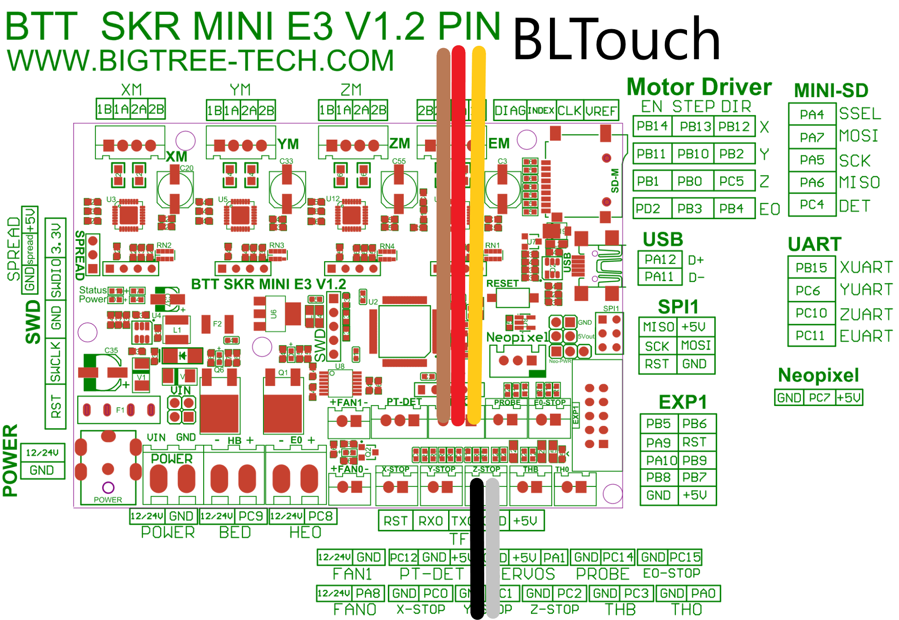
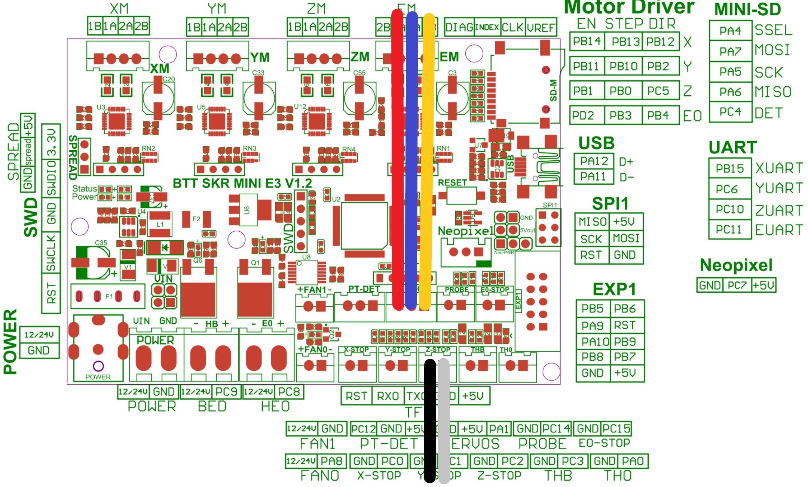
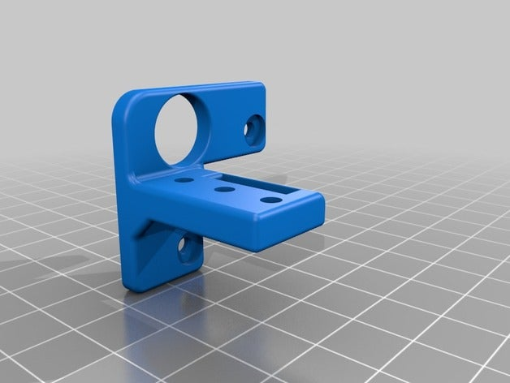
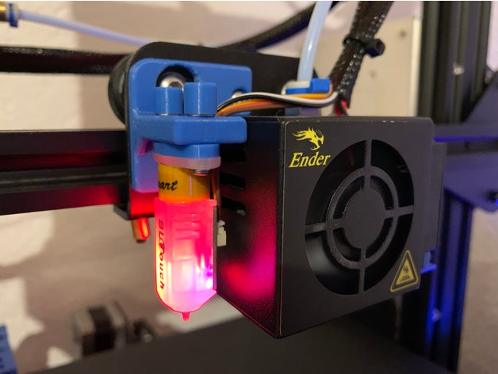

# SKR MINI E3 v1.2 board Marlin 2.0 firmware for an Ender 3 Pro w/BLtouch (Standard mount) #

## BLTouch Wiring

Bigtreetech have recommended that the BL touch be plugged into the Z-stop and Servo ports and therefore the firmware has been configured as such.

<u>**Antclabs Bltouch**</u>



<u>**Creality BLtouch**</u> - Many thanks to [nickwebcouk](https://github.com/nickwebcouk) for the info.


<u>**Others?**</u>

 If you have a BLtouch with different colours, the SKR Mini E3 pinouts you need are


For those with Red, Blue and Yellow wires to your servo post, they should be in that order.


## BLtouch Troubleshooting 

Just a few points from my experiences.

1. If the BLtouch lights up when you power on the printer.  You at least have the 5V wire in the correct place.  Within the printer BLtouch menu, select **Deploy Probe**  If the probe tip doesn't deploy, then you need to swap the two outer cables (GND + PA1)
2. I tried a few different pinouts before I actually read the manual.  Despite this, my BLtouch didnt fry itself, as long as you are using the Servo and Z-stop ports you should be ok if you get it wrong.  


## BLTouch Mount & Spacer



**Bltouch mount** https://www.thingiverse.com/thing:3068970

**Bltouch spacer** https://www.thingiverse.com/thing:3466223

If you use a different mount, just make sure you update the offsets and recompile.  You can find these in the in **configuration.h**

```
/**
 * Z Probe to nozzle (X,Y) offset, relative to (0, 0).
 * X and Y offsets must be integers.
 *
 * In the following example the X and Y offsets are both positive:
 * #define X_PROBE_OFFSET_FROM_EXTRUDER 10
 * #define Y_PROBE_OFFSET_FROM_EXTRUDER 10
 *
 *     +-- BACK ---+
 *     |           |
 *   L |    (+) P  | R <-- probe (20,20)
 *   E |           | I
 *   F | (-) N (+) | G <-- nozzle (10,10)
 *   T |           | H
 *     |    (-)    | T
 *     |           |
 *     O-- FRONT --+
 *   (0,0)
 */
#define X_PROBE_OFFSET_FROM_EXTRUDER -43  // X offset: -left  +right  [of the nozzle]
#define Y_PROBE_OFFSET_FROM_EXTRUDER -6  // Y offset: -front +behind [the nozzle]
#define Z_PROBE_OFFSET_FROM_EXTRUDER 0   // Z offset: -below +above  [the nozzle]

```

For help with measuring this, check this Teaching Tech video https://youtu.be/sUlqrSq6LeY?t=400

Credit to [MrPeaski](https://www.reddit.com/user/MrPeaski/) for pointing out this cool BLtouch calibration tool that may help you setting up your probe measurements.... https://www.thingiverse.com/thing:3330245


## Did this help you?

If this guide was of some use, please consider buying me a coffee.  [](https://www.paypal.com/cgi-bin/webscr?cmd=_s-xclick&hosted_button_id=ADET3SXGZ9BNU)


## Revision History

**14-Oct-2019**	- Updated Readme.md with

1. Wiring diagram for Creality BLTouch (Thanks Nickwebcouk)
2. Additional info about the BLTouch spacer I use.
3. Link to BLTouch calibration tool (Thanks MrPeaski)						

**13-Oct-2019**	- Added **FAN_SOFT_PWM** recommendation from Bigtreetech


## Marlin license


## License

Marlin is published under the [GPL license](/LICENSE) because we believe in open development. The GPL comes with both rights and obligations. Whether you use Marlin firmware as the driver for your open or closed-source product, you must keep Marlin open, and you must provide your compatible Marlin source code to end users upon request. The most straightforward way to comply with the Marlin license is to make a fork of Marlin on Github, perform your modifications, and direct users to your modified fork.

While we can't prevent the use of this code in products (3D printers, CNC, etc.) that are closed source or crippled by a patent, we would prefer that you choose another firmware or, better yet, make your own.
